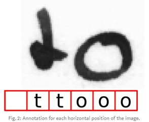
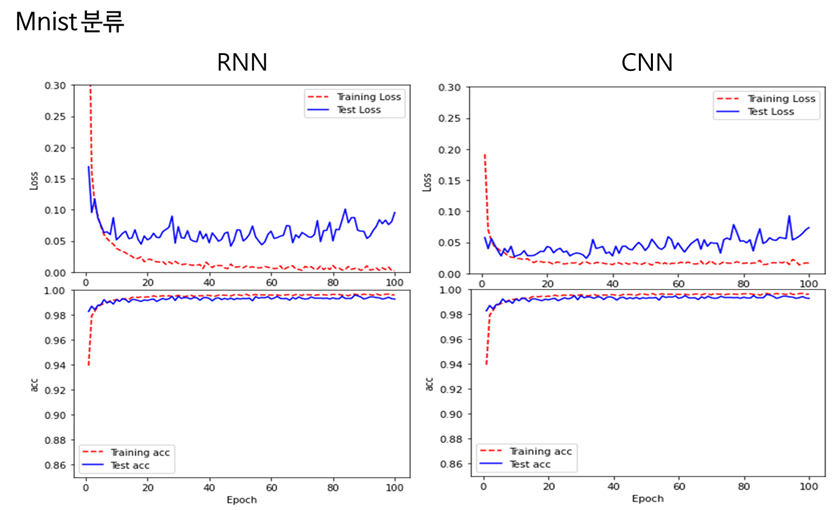
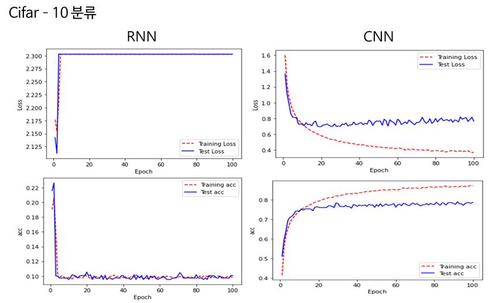
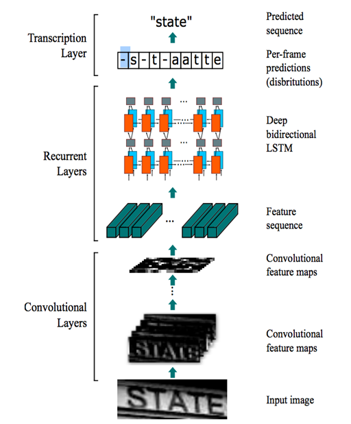

## RNN 이미지 분류

1. 이미지를 인스턴스 수, 특징 수(가로), 채널 수 (세로) 로 구성 (32x32)

   

2. 특징 수 만큼 시계열 데이터를 구성하고, 한 특징에서 채널 수 만큼의 데이터를 사용하여 분류 

3. 1열당 32개의 채널이 있고, 32개의 열을 모두 예측, 설정한 출력 수 만큼 분할하여 특징 맵 출력

   

4. 최종 출력을 단어 수 만큼 설정하고, Loss 가 작아지는 방향으로(단어와 일치하는 방향) 가중치를 조절 하여 학습 

## RNN 이미지 분류 (CNN과의 차이)

Mnist 분류

- RNN, CNN 모두 좋은 성능을 보이며, 모델 학습의 무작위성을 고려하면 유사한 성능

Cifar-10 분류

(Cifar – 10 : 32*32 (1,024개의 픽셀), 10개 클래스, 3채널(RGB))

(RNN 학습 시에는 3차원 데이터 학습이 불가하여 1024*3의 데이터로 변환하여 학습)

- 결론 : 쉬운 2차원 이미지의 경우 RNN과 CNN의 성능이 유사하지만, 어려운 3차원 이미지의 경우 세로와 가로를 합하여 2차원으로 만들거나, 채널 중 하나만을 택해 2차원으로 만든 후 RNN 학습을 해도 RNN모델의 성능이 많이 안 좋은 것을 알 수 있다.

- RNN 분류의 문제

1. 한 문자가 여러 특징에 거쳐 있을 수 있다.
2. 한 특징에 여러 문자가 거쳐있을 수 있다.
3. 3차원 데이터를 사용할 수 없다.

## CRNN

1. CNN은 이미지 데이터에서 직접 정보를 얻음 (사람이 만든 특징, 전처리 단계가 불필요)

2. RNN과 동일한 속성을 가지며 시계열 label을 생성

3. 학습과 테스트 단계 모두에서 시계열 데이터의 길이에 제약을 받지 않음

4. 단어 인식에서 좋은 성능

5. DCNN 모델보다 적은 매개 변수 사용

6. 글자 마다의 인식이 아니라, 단어 자체를 인식 가능 (단어마다 label 필요 없음)

## 결과

## Reference

- [https://www.kaggle.com/samfc10/handwriting-recognition-using-crnn-in-keras/data?select=validation_v2](https://www.kaggle.com/samfc10/handwriting-recognition-using-crnn-in-keras/data?select=validation_v2)
- [https://towardsdatascience.com/intuitively-understanding-connectionist-temporal-classification-3797e43a86c](https://towardsdatascience.com/intuitively-understanding-connectionist-temporal-classification-3797e43a86c)
- [https://medium.com/@mldevhong/%EB%85%BC%EB%AC%B8-%EB%B2%88%EC%97%AD-rcnn-an-end-to-end-trainable-neural-network-for-image-based-sequence-recognition-and-its-f6456886d6f8](https://medium.com/@mldevhong/논문-번역-rcnn-an-end-to-end-trainable-neural-network-for-image-based-sequence-recognition-and-its-f6456886d6f8)
- An End-to-End Trainable Neural Network for Image-based Sequence
- Recognition and Its Application to Scene Text Recognition
