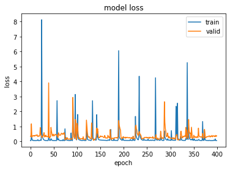
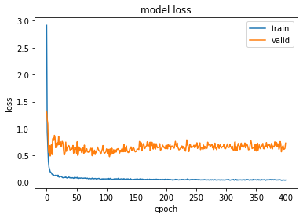
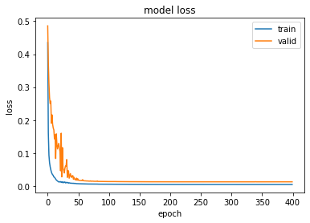
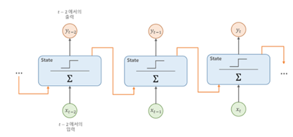
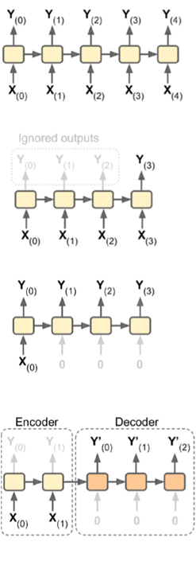

## 연구 목표

ESS 상의 에너지 구매 시나리오에서 시간대별 에너지 가격을 고려한 최적 온도를 설정하고, 외부온도 및 온 냉방기 가동률에 따른 내부온도를 예측하여 에너지 HVAC의 에너지 효율을 높인다.

## 여러 ML 모델 사용

1. 기존 DNN

   - 최적 - i= 4 mae= 0.027647488765344452 mape= 1.0035797513358802
   - 최악 - i= 67 mae= 0.06621827340582334 mape= 28.988158829777156

2. Randomforest

   - 최적 - i= 7 mae= 6.607017079625817e-05 mape= 0.002819250867512552
   - 최악 - i= 6 mae= 0.15260843273053118 mape= 8.892929369899898

3. DecisionTree

   - 최적 – i= 39 mae= 0.00019950000140064872 mape= 0.005727964283603041
   - 최악 – i= 6 mae= 0.19011985341720053 mape= 11.263086151174477

4. SVM

   - i= 0 mae= 1.5043743670964715e+208 mape= 6.941267376858748e+209
   - i= 1 mae= 1.4580535803264403e+205 mape= 7.514641461505858e+206

5. Gradient Boosting 

   - 최적 - i= 43 mae= 0.0040230567264781985 mape= 0.10725512760458922
   - 최악 - i= 6 mae= 0.14993050801458177 mape= 8.645546197080979

6. Linear Regression 

   - 최적 - i= 60 mae= 0.08557696630444132 mape= 3.278135559765273

   - 최악 – i= 67 mae= 0.1643109062385661 mape= 81.47454609708183

7. Polynomial Regression

   - 최적 - i= 3 mae= 0.005236193720733843 mape= 0.21569168910206613
   - 최악 – i= 67 mae= 0.06548293658639764 mape= 25.81101183962422

## DNN 개선

1. 90*3

   

2. 64*3

   

3. 90,(0.5),90,(0.5),90

   

4. 32*3

   

- 최적의 모델 : 4    (단순할수록 잘 예측)
- 최적 i= 8 mae= 0.0007278453051984268 mape= 0.038303026383259865
- 최악 i= 64 mae= 0.12111916166854646 mape= 7.043374829348389

## 표준화

1. 기존 : testset을 test하는 과정에서 한 시간씩 생성한다 (1차원)

   - 문제 -> StandardScaler() .fit_transform() 함수는 2차원을 필요로 함
   - 수정 -> 가장 예측이 잘 된 Randomforest 모델로 testset을 생성 후 표준화 

2. Randomforest

   - 최적:i= 1 mae= 1.157579347297051 mape= 47.58772529911893
   - 최악:i= 68 mae= 0.9087884696631517 mape= 231.4439885658146

3. DecisionTree

   - 최적:i= 68 mae= 0.24181561810014077 mape= 46.07525616853937
   - 최악:i= 67 mae= 0.5378934407086103 mape= 103.24216254708789
   - 최악:i= 67 mae= 0.5378934407086103 mape= 103.24216254708789

4. SVM

   - 최적:i= 17 mae= 13.010975561826505 mape= 425.56280971541076

   - 최악:i= 67 mae= 15.645093614605514 mape= 5342.8668256052615

5. Gradient Boosting 

   - 최적:i= 68 mae= 0.21512678881826242 mape= 26.801872704799646

   - 최악:i= 86 mae= 1.0645086442460556 mape= 103.30284576043928

6. 32*3 DNN

   - 최적:i= 44 mae= 0.7609538584258907 mape= 18.906564852036155

   - 최악:i= 67 mae= 3.0756948096880925 mape= 1152.3930971235975

## RNN

- 순환 신경망 : 임의 길이를 가진 시퀀스 (sequence)를 다룸

- 이전 : 활성화 신호가 한 방향으로만 흐르는 피드포워드 신경망 (입->출)

  

- 순환 신경망 

  -> '뒤쪽으로 향하는 연결’이 존재

   (connection pointing backward)

- 타임스텝 : 매 연결 

  (…, t-3, t-2, t-1, t)

  

- 𝒃는 편향, 𝜙( )는 활성화 함수, ReLU보다 tanh를 선호

  -> 수식에 의하면 타임스텝 t에서 모든 입력을 x(t)로 만들면,

   결국 y(t)는 모든 입력 (x(0),x(1),…,(x(t))에 대한 함수

- 타임 스텝에 걸쳐서 '어떤 상태를 보존'하는 신경망의 구성 요소를 '메모리 셀 (memory cell)' 또는 간단히 '셀 (cell)'이라 함

- 하나의 순환 뉴런 또는 순환층은 매우 기본적인 셀로서 아주 짧은 패턴을 학습할 수 있음 (학습 대상에 따라 다르나 보통 약 10 스텝 정도 유지되는 패턴) 

  

- sequence-to-sequence 네트워크

  - Ex) 최근 N일치 주식가격을 주입하면 네트워크는 하루 앞선 가격을 출력 (N-1일 전부터 내일까지)

- sequence-to-vector 네트워크
  - Ex) 영화 리뷰에 있는 연속된 단어를 주입하면 네트워크가 감성 점수를 출력 
- vector-to-sequence 네트워크
  - 첫 번째 타임 스텝에서 단 하나의 입력만 (다른 모든 타임 스텝에서는 0을) 네트워크에 주입 Ex) 이미지를 입력하여 이미지에 대한 캡션을 출력
- delayed sequence-to-sequence 네트워크
  - Ex)한 언어의 문장을 네트워크에 주입하면 인코더는 이 문장을 하나의 벡터 표현으로 변환 디코더가 이 벡터를 다른 언어의 문장으로 디코딩

- 이중 단계 모델은 하나의 시퀀스-투-시퀀스 RNN을 사용해 한 단어씩 번역하는 것 보다 훨씬 더 잘 동작

- 문제점 :

  RNN이 길어지면 훈련 단계는 네트워크를 통해 역전파되는 경사도를 매우 작거나 크게 만들어 가중치를 0 또는 무한으로 만드는 경우가 생긴다.

  (vanishing gradient),(exploding gradient)

  - LSTM에서는 이 문제를 해결하기 위해 각 타임 스텝에서 두개의 출력을 사용. (하나는 모델의 실제 출력, 다른 하나는 해당 단계의 메모리 상태)

## LSTM 결과

