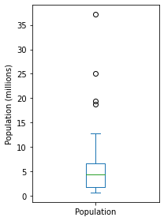
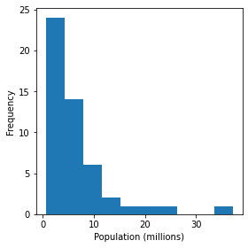
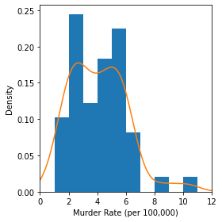
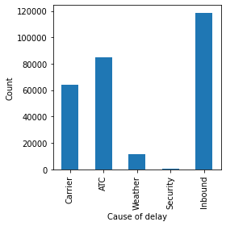
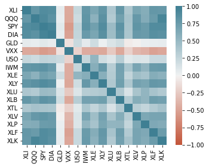
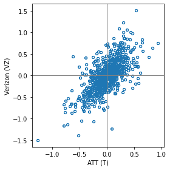
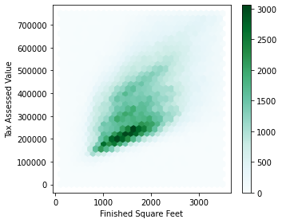
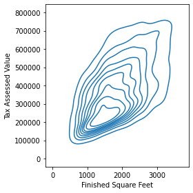
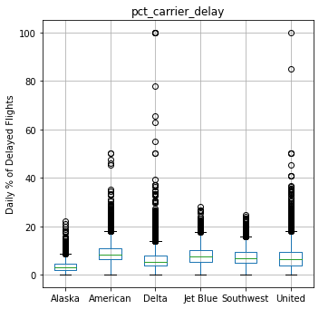

## 1. 정형화된 데이터의 요소

- numeric : 숫자를 이용해 표현할 수 있는 데이터
- continuous : 일정 범위 안에서 어떤 값이든 취할 수 있는 데이터
- discrete : 횟수와 같은 정수 값만 취할 수 있는 데이터
- dategorical : 가능한 범주 안의 값만을 취하는 데이터
- binary : 두 개의 값 만을 갖는 범주형 데이터
- ordinal : 순위가 있는 범주형 데이터

## 2. 테이블 데이터

- data frame : 숫자를 이용해 표현할 수 있는 데이터
- feature : 일정 범위 안에서 어떤 값이든 취할 수 있는 데이터
- outcome : 횟수와 같은 정수 값만 취할 수 있는 데이터
- record : 가능한 범주 안의 값만을 취하는 데이터

##  3. 위치 추정

```python
state = pd.read_csv(STATE_CSV)
print(state.head(8))
```

```
 State  Population  Murder.Rate Abbreviation
0      Alabama     4779736          5.7           AL
1       Alaska      710231          5.6           AK
2      Arizona     6392017          4.7           AZ
3     Arkansas     2915918          5.6           AR
4   California    37253956          4.4           CA
5     Colorado     5029196          2.8           CO
6  Connecticut     3574097          2.4           CT
7     Delaware      897934          5.8           DE
```


* mean : 모든 값의 총합을 개수로 나눈 값

  ```python
  state = pd.read_csv(STATE_CSV)
  print(state['Population'].mean())
  ```

  ```
  6162876.3
  ```

* weighted mean : 가중치를 곱한 값의 총합을 가중치의 총합으로 나눈 값

  ```python
  print(np.average(state['Murder.Rate'], weights=state['Population']))
  ```

  ```
  4.066
  ```

* median : 중간값

  ```python
  print(state['Population'].median())
  ```

  ```
  4436369.5
  ```

* percentile : 백분위

* weighted median : 가중 치 값을 위에서부터 더할 때, 총합의 중간이 위치하는 데이터 값

  ```python
  print(wquantiles.median(state['Murder.Rate'], weights=state['Population']))
  ```

  ```
  4.445833981123393
  ```

* trimmed mean : 정해진 개수의 극단값을 제외한 나머지 값들을 평균

* robust : 극단값들에 민감하지 않다는 것을 의미

* outlier : 대부분의 값과 다른 데이터 값

## 4. 변이 추정

* deviation : 관측값과 위치 추정값 사이의 차이

* variance : 평균과의 편차를 제곱한 값들의 합을 (데이터 수-1)로 나눈 값

* standard deviation : 분산의 제곱근

* mean absolute deviation : 평균과의 편차의 절댓값의 평균

* MAD : 중간값과 편차의 절댓값의 중간값

* range : 최대, 최소의 차이

* order statistics : 최소에서 최대까지 정렬된 데이터 값에 따른 계량형

* percentile : 어떤 값들의 퍼센트가 이 값 혹은 더 작은 값을 갖고, 퍼센트가 이값 혹은 더 큰 값을 갖도록 하는 값

  ```python
  percentages = [0.05, 0.25, 0.5, 0.75, 0.95]
  df = pd.DataFrame(state['Murder.Rate'].quantile(percentages))
  df.index = [f'{p * 100}%' for p in percentages]
  print(df.transpose())
  ```

  ```
               5.0%  25.0%  50.0%  75.0%  95.0%
  Murder.Rate   1.6  2.425    4.0   5.55   6.51
  ```

* interquartile range : 75번째 백분위수와 25번째 백분위수 사이의 차이

## 5. 데이터 분포 탐색하기

* boxplot : 투키가 데이터의 분포를 시각화하기 위한 간단한 방법으로 소개한 그림

  ```python
  ax = (state['Population']/1_000_000).plot.box(figsize=(3, 4))
  ax.set_ylabel('Population (millions)')

  plt.tight_layout()
  plt.show()
  ```

  

* frequency table : 어떤 구한에 해당하는 수치 데이터 값들의 빈도를 나타내는 기록

  ```python
  binnedPopulation = pd.cut(state['Population'], 10)
  binnedPopulation.name = 'binnedPopulation'
  df = pd.concat([state, binnedPopulation], axis=1)
  df = df.sort_values(by='Population')

  groups = []
  for group, subset in df.groupby(by='binnedPopulation'):
      groups.append({
          'BinRange': group,
          'Count': len(subset),
          'States': ','.join(subset.Abbreviation)
      })
  ```

* histogram : x축은 구간들을, y축은 빈도수를 나타내는 도수 테이블의 그림. (중간에 틈이 없다는 점이 막대그래프와의 차이이다.)

  ```python
  ax = (state['Population'] / 1_000_000).plot.hist(figsize=(4, 4))
  ax.set_xlabel('Population (millions)')

  plt.tight_layout()
  plt.show()
  ```

  

* density plot : 히스토그램을 부드러운 곡선으로 나타낸 그림 ( 커널밀도추정을 주로 사용 )

  ```python
  ax = state['Murder.Rate'].plot.hist(density=True, xlim=[0, 12], 
                                      bins=range(1,12), figsize=(4, 4))
  state['Murder.Rate'].plot.density(ax=ax)
  ax.set_xlabel('Murder Rate (per 100,000)')

  plt.tight_layout()
  plt.show()
  ```

  

## 6. 이진 데이터와 범주 데이터 탐색하기

* mode : 가장 자주 등장하는 범주 혹은 값

* expected value : 범주에 해당하는 어떤 수치가 있을 때, 범주의 출현 확률에 따른 평균

* bar chart : 각 범주의 빈도수 혹은 비율을 막대로 나타낸 그림

  ```python
  ax = dfw.transpose().plot.bar(figsize=(4, 4), legend=False)
  ax.set_xlabel('Cause of delay')
  ax.set_ylabel('Count')

  plt.tight_layout()
  plt.show()
  ```

  

* pie chart : " 부채꼴 모양으로 나타낸 그림

## 7. 상관관계

* correlation coefficient : 수치적 변수들 간에 어떤 관계가 있는지를 나타내기 위해 사용되는 측정량

* correlation matrix : 행과 열이 변수들을 의미하는 표를 말하며, 각 셀은 그 행과 열에 해당하는 변수들의 상관관계를 의미한다.

  ```python
  # Determine telecommunications symbols
  telecomSymbols = sp500_sym[sp500_sym['sector'] == 'telecommunications_services']['symbol']

  # Filter data for dates July 2012 through June 2015
  telecom = sp500_px.loc[sp500_px.index >= '2012-07-01', telecomSymbols]
  telecom.corr()
  print(telecom
  ```

  ```
                     T       CTL       FTR        VZ      LVLT
  2012-07-02  0.422496  0.140847  0.070879  0.554180 -0.519998
  2012-07-03 -0.177448  0.066280  0.070879 -0.025976 -0.049999
  2012-07-05 -0.160548 -0.132563  0.055128 -0.051956 -0.180000
  2012-07-06  0.342205  0.132563  0.007875  0.140106 -0.359999
  2012-07-09  0.136883  0.124279 -0.023626  0.253943  0.180000
  ...              ...       ...       ...       ...       ...
  2015-06-25  0.049342 -1.600000 -0.040000 -0.187790 -0.330002
  2015-06-26 -0.256586  0.039999 -0.070000  0.029650 -0.739998
  2015-06-29 -0.098685 -0.559999 -0.060000 -0.504063 -1.360000
  2015-06-30 -0.503298 -0.420000 -0.070000 -0.523829  0.199997
  2015-07-01 -0.019737  0.080000 -0.050000  0.355811  0.139999
  ```

  ```python
  fig, ax = plt.subplots(figsize=(5, 4))
  ax = sns.heatmap(etfs.corr(), vmin=-1, vmax=1, 
                   cmap=sns.diverging_palette(20, 220, as_cmap=True),
                   ax=ax)

  plt.tight_layout()
  plt.show()
  ```

  

* scatterplot : x축과 y축이 서로 다른 두 개의 변수를 나타내는 도표

  ```python
  ax = telecom.plot.scatter(x='T', y='VZ', figsize=(4, 4), marker='$\u25EF$')
  ax.set_xlabel('ATT (T)')
  ax.set_ylabel('Verizon (VZ)')
  ax.axhline(0, color='grey', lw=1)
  ax.axvline(0, color='grey', lw=1)

  plt.tight_layout()
  plt.show()
  ```

  

## 8. 두개이상의 변수 탐색하기

* contingency table : 두가지 이상의 범주형 변수의 빈도수를 기록한 표

  ```python
  kc_tax = pd.read_csv(KC_TAX_CSV)
  kc_tax0 = kc_tax.loc[(kc_tax.TaxAssessedValue < 750000) & 
                       (kc_tax.SqFtTotLiving > 100) &
                       (kc_tax.SqFtTotLiving < 3500), :]
  ```

* hexagonal binning : 두 변수를 육각형 모양의 구간으로 나눈 그림

  ```python
  ax = kc_tax0.plot.hexbin(x='SqFtTotLiving', y='TaxAssessedValue',
                           gridsize=30, sharex=False, figsize=(5, 4))
  ax.set_xlabel('Finished Square Feet')
  ax.set_ylabel('Tax Assessed Value')

  plt.tight_layout()
  plt.show()
  ```

  

* contour plot : 지도상에 같은 높이의 지점을 등고선으로 나타내는 것처럼, 두 변수의 밀도를 등고선으로 표시한 도표

  ```python
  fig, ax = plt.subplots(figsize=(4, 4))
  sns.kdeplot(data=kc_tax0.sample(10000), x='SqFtTotLiving', y='TaxAssessedValue', ax=ax)
  ax.set_xlabel('Finished Square Feet')
  ax.set_ylabel('Tax Assessed Value')

  plt.tight_layout()
  plt.show()
  ```

  

* violin plot : 상자그림과 비슷하지만 밀도추정을 함께 보여줌

  ```python
  airline_stats = pd.read_csv(AIRLINE_STATS_CSV)
  airline_stats.head()
  ax = airline_stats.boxplot(by='airline', column='pct_carrier_delay',
                             figsize=(5, 5))
  ax.set_xlabel('')
  ax.set_ylabel('Daily % of Delayed Flights')
  plt.suptitle('')

  plt.tight_layout()
  plt.show()
  ```



